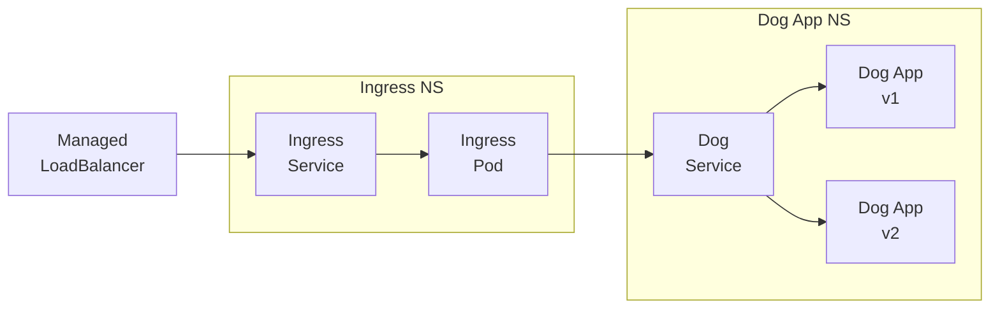

# K8s ManifestのPolicy Test(Conftest/OPA Gatekeeper/Konstraint/gator)

## はじめに

Kubernetes Manifestに対して使えるPolicy Testingのツールをいくつか試してみます。

1. ConftestでK8s ManifestのPolicy Testing
2. OPA GatekeeperでK8s ManifestのPolicy Testing
3. KonstraintでRegoとConstraintTemplateを管理
4. GatorでConstraintTemplate/Constraintも含めたPolicy Testing

「やってみた」系の記事になりますので、Regoの書き方やConftestのサブコマンドを網羅するような内容ではありません。そちらが気になるかたは公式ドキュメントの確認をお願いします。

## 想定シナリオ



クラスタ外からManaged LoadBalancerを通って各種システムが利用されます。
また、現在Dog Applicationは2つのバージョンが稼働しています。

@import "./app-manifest/service.yaml"

@import "./app-manifest/deployment-v1.yaml"

@import "./app-manifest/deployment-v2.yaml"

Dog App NamespaceのManifestを見ていくことにします。

## 想定要件

Dog Appの開発者が作成するYAMLについて要件を考えてみます。

|K8s Resource|満たすべき要件|
| --- | --- |
|Service|想定外の外部公開を防ぐため、`type`は`ClusterIP`のみとする。|
|Deployment|PodTemplateのlabelには`app`と`version`をつける。|

開発者が作成するManifestについて、上記要件を満たしているか静的/動的 Policy Testを行っていきましょう。

## ConftestでPolicy Testing

ConftestはKubernetes Manifestなどの構造化されたデータに対するポリシーチェックを行うためのツールです。
ポリシーを記述するにはOpen Policy AgentのRego言語を利用します。


まずはconftestのドキュメントにあるregoコードをベースにRuleを書いてみました。

@import "./policy/deployment.rego"

@import "./policy/service.rego"

以降、Dog ApplicationのManifestは`app-manifest`ディレクトリ、Regoは`policy`ディレクトリに配置することとします。

```
.
├── README.md
├── app-manifest
│   ├── deployment-v1.yaml
│   ├── deployment-v2.yaml
│   └── service.yaml
└── policy
    └── deployment.rego
```

`conftest`コマンド実行時、デフォルトで`./policy`ディレクトリにある`.rego`を参照します。明示的にディレクトリを指定したい場合は`--policy`オプションを付けて実行する必要があります。

実行してみましょう。

```bash
$ conftest test --namespace deployment ./app-manifest/deployment-v1.yaml 

2 tests, 2 passed, 0 warnings, 0 failures, 0 exceptions
```

```bash
$ conftest test --namespace deployment ./app-manifest/deployment-v2.yaml 

2 tests, 2 passed, 0 warnings, 0 failures, 0 exceptions
```

```bash
$ conftest test --namespace service ./app-manifest/service.yaml 

1 test, 1 passed, 0 warnings, 0 failures, 0 exceptions
```

すべてのPolicy Testが通りました。
試しに`version`を消したDeploymentで試してみます。

@import "./app-manifest/deployment-without-label.yaml"


```bash
$ conftest test --namespace deployment ./app-manifest/deployment-without-label.yaml 
FAIL - ./app-manifest/deployment-without-label.yaml - deployment - Containers must provide version label for pod

2 tests, 1 passed, 0 warnings, 1 failure, 0 exceptions
```

1 passed, 1 failureとなりました。コメントにあるようにversion labelがないためです。


DeploymentとServiceのManifestに対するPolicy Testをとりあえず動かすところまでできました。
次にRule自体が正しいかのテストを書いていきます。

要件は下記の通りなので、そこからテストをざっくり書き出してみます。

|K8s Resource|満たすべき要件|
| --- | --- |
|Service|想定外の外部公開を防ぐため、`type`は`ClusterIP`のみとする。|
|Deployment|PodTemplateの`label`には`app`と`version`をつける。|

|K8s Resource|テストの内容|分類|
| --- | --- | --- |
| Deployment | PodTemplateのlabelに`app`と`version`がある |正常系|
| Deployment | PodTemplateのlabelに`app`がなく`version`がある |異常系|
| Deployment | PodTemplateのlabelに`app`があり`version`がない |異常系|
| Deployment | PodTemplateのlabelに`app`も`version`もない |異常系|
| Service | typeが`ClusterIP`|正常系|
| Service | typeが設定されていない(＝`ClusterIP`)|正常系|
| Service | typeが`NodePort`|異常系|
| Service | typeが`LoadBalancer`|異常系|

上記をもとにRegoのテストを書いてみました。

@import "./policy/deployment_test.rego"

@import "./policy/service_test.rego"

Ruleに対するテストを実行してみましょう。

```
$ conftest verify --policy ./policy 

8 tests, 8 passed, 0 warnings, 0 failures, 0 exceptions, 0 skipped
```

上手くいきました。
今回は単純なRuleですが、実際の現場では複数のManifestに横断するような複雑なRuleを記載することもあるためRegoのRule自体のテストはしっかりと書きましょう。

以上、Conftestでできることをざっくりまとめると下記の通りとなります。

- Regoを使ったPolicy Testing（`conftest test`）
- Regoに記載したruleのテスト（`conftest verify`）

Kubernetesクラスタが利用できない環境でのPolicy TestingにはConftestは使えそうです。
次はOPA Gatekeeperを利用してKubernetesクラスタ環境でのPolicy Testingをやってみます。

## OPA GatekeeperでPolicy Testing

OPA GatekeeperはKubernetesクラスタ上でAdmission Controllerとして動作し、特定のManifestのapplyを禁止するなどの機能を実現するためのツールです。

Conftestと同じく、ポリシーを記述するにはOpen Policy AgentのRego言語を利用しますが、入力パラメータの参照方法が少し違ったりしています。

GatekeeperにはRegoに加えて`ConstraintTemplate`と`Constraint`が必要になるので、まずはそれを作成します。


@import "./gk-manifest/deployment/template.yaml"

このManifestでテンプレートができたので`.spec.crd.spec.names.kind`の`K8sDeploymentPodTemplateRequredLabels`を作成します。

Conftestでは`app`と`version`のPolicyを別々に作成していましたが、流用のしやすさを考え、`.spec.crd.spec.validation.openAPIV3Schema.properties`の部分でパラメータ化しています。

@import "./gk-manifest/deployment/constraint.yaml"

対象は`dog-app`Namespaceにある`Deployment`としており、必要とするLabelは`app`と`version`です。

Serviceも同じようにTemplateとConstraintを作成します。

@import "./gk-manifest/service/template.yaml"

@import "./gk-manifest/service/constraint.yaml"

上記のManifestはK8sクラスタにapplyしておきます。

```bash
$ kubectl get k8sdeploymentpodtemplaterequiredlabels.constraints.gatekeeper.sh 
NAME                                      ENFORCEMENT-ACTION   TOTAL-VIOLATIONS
podtemplate-must-have-app-version-label                        0
```

```bash
$ kubectl get k8sservicerequiredtype.constraints.gatekeeper.sh 
NAME                         ENFORCEMENT-ACTION   TOTAL-VIOLATIONS
service-required-clusterip                        0
```

準備ができたので、Dog ApplicationのYAMLをapplyしてみます。

```bash
$ kubectl apply -f app-manifest/deployment-v1.yaml 
deployment.apps/dog-app-deployment-v1 created

$ kubectl apply -f app-manifest/deployment-v2.yaml 
deployment.apps/dog-app-deployment-v2 created

$ kubectl apply -f app-manifest/service.yaml 
service/dog-app created
```

上記は要件を満たしたManifestであるため問題なく作成されました。
次に、要件を満たしていないManifestをapplyしてみます。

```bash
$ kubectl apply -f app-manifest/deployment-without-label.yaml 
Error from server (Forbidden): error when creating "app-manifest/deployment-without-label.yaml": admission webhook "validation.gatekeeper.sh" denied the request: [podtemplate-must-have-app-version-label] you must provide labels: {"version"}
```

`version` LabelがないDeploymentをapplyした場合は上記の通り拒否されます。

```
$ kubectl apply -f app-manifest/service-nodeport.yaml 
Error from server (Forbidden): error when applying patch:
{"metadata":{"annotations":{"kubectl.kubernetes.io/last-applied-configuration":"{\"apiVersion\":\"v1\",\"kind\":\"Service\",\"metadata\":{\"annotations\":{},\"name\":\"dog-app\",\"namespace\":\"dog-app\"},\"spec\":{\"ports\":[{\"port\":80,\"targetPort\":80}],\"selector\":{\"app\":\"nginx\"},\"type\":\"NodePort\"}}\n"}},"spec":{"type":"NodePort"}}
to:
Resource: "/v1, Resource=services", GroupVersionKind: "/v1, Kind=Service"
Name: "dog-app", Namespace: "dog-app"
for: "app-manifest/service-nodeport.yaml": error when patching "app-manifest/service-nodeport.yaml": admission webhook "validation.gatekeeper.sh" denied the request: [service-required-clusterip] you must set service type: ClusterIP
```

`NodePort`のServiceをapplyした場合と

```bash
$ kubectl apply -f app-manifest/service-loadbalancer.yaml 
Error from server (Forbidden): error when applying patch:
{"metadata":{"annotations":{"kubectl.kubernetes.io/last-applied-configuration":"{\"apiVersion\":\"v1\",\"kind\":\"Service\",\"metadata\":{\"annotations\":{},\"name\":\"dog-app\",\"namespace\":\"dog-app\"},\"spec\":{\"ports\":[{\"port\":80,\"targetPort\":80}],\"selector\":{\"app\":\"nginx\"},\"type\":\"LoadBalancer\"}}\n"}},"spec":{"type":"LoadBalancer"}}
to:
Resource: "/v1, Resource=services", GroupVersionKind: "/v1, Kind=Service"
Name: "dog-app", Namespace: "dog-app"
for: "app-manifest/service-loadbalancer.yaml": error when patching "app-manifest/service-loadbalancer.yaml": admission webhook "validation.gatekeeper.sh" denied the request: [service-required-clusterip] you must set service type: ClusterIP
```

`LoadBalancer`のServiceをapplyした場合は上記の通り拒否されます。

以上、OPA Gatekeeperでできることをざっくりまとめると下記の通りとなります。

- KubernetesのAdmission ControllerでのPolicy Testing

Kubernetesクラスタが利用できる環境でのPolicy TestingにOPA Gatekeeperが利用できることがわかりました。

ConftestもOPA GatekeeperもRegoを利用してPolicyを書きましたが両方には若干の書き方の違いがあることがわかりました。また、OPA GatekeeperはConstraintTemplateにRegoを埋め込まないといけません。

上記の負荷を下げるために、次はKonstraintを導入してみます。

## KonstraintでRegoとConstraintTemplateを管理する

KonstraintはRegoからGatekeeperのConstraintTemplateを生成するためのツールです。またGithubリポジトリにはConftestとGatekeeperのRegoの差異をある程度吸収するためのライブラリも公開しています。

https://github.com/plexsystems/konstraint/tree/main/examples/lib

上記のlibの中身を少しのぞいてみましょう。

https://github.com/plexsystems/konstraint/blob/main/examples/lib/core.rego

```rego
package lib.core

default is_gatekeeper = false

is_gatekeeper {
	has_field(input, "review")
	has_field(input.review, "object")
}

resource = input.review.object {
	is_gatekeeper
}

resource = input {
	not is_gatekeeper
}

# 略
```

Conftestの場合、YAMLがinputとなるため`input.<Resouceのspec>`となるのですが、Gatekeeperの場合は`AdmissionReview`がinputとなるため、`input.review.object.<Resourceのspec>`となります。
その差異を吸収して`resource.<Resourceのspec>`でアクセスできるようにしよう、というのが上のライブラリになります。

このライブラリをつかってConftestのRegoとGatekeeperのRegoの際を吸収してみましょう。まずはConftestのRegoから修正します。
（`METADATA`のコメントがありますが、いったん無視してください。このあとのKonstraintで利用します。）

@import "./k8s-deployment-podtemplate-required-labels/deployment.rego"

@import "./k8s-deployment-podtemplate-required-labels/deployment_test.rego"

@import "./k8s-service-required-type/service.rego"

@import "./k8s-service-required-type/service_test.rego"

Ruleに対するテストが通ることも確認しておきます。

```bash
$ conftest verify --policy ./k8s-deployment-podtemplate-required-labels/

33 tests, 33 passed, 0 warnings, 0 failures, 0 exceptions, 0 skipped

$ conftest verify --policy ./k8s-service-required-type/

33 tests, 33 passed, 0 warnings, 0 failures, 0 exceptions, 0 skipped
```

テストケースが想定よりも多くでていますが、これはKonstraintのlibのテストケースが含まれているためです。

次にConstraintTemplateを作る必要があるのですが、lib含めたRegoを毎回手作業でConstraintTemplateにするのは負荷が高いです。
KonstraintにはRegoからConstraintTemplateを作成する機能がありますのでそれを使ってみましょう。

```bash
$ konstraint create k8s-deployment-podtemplate-requred-labels/
WARN[0000] Skipping constraint generation due to use of parameters  name=K8sDeploymentPodtemplateRequredLabels src=k8s-deployment-podtemplate-requred-labels/deployment.rego
INFO[0000] completed successfully                        num_policies=1
```

```bash
$ konstraint doc k8s-deployment-podtemplate-requred-labels/
WARN[0000] No kind matchers set, this can lead to poor policy performance.  name=K8sDeploymentPodtemplateRequredLabels src=k8s-deployment-podtemplate-requred-labels/deployment.rego
INFO[0000] completed successfully                        num_policies=1
```

ConstraintTemplateが作成されました。
Constraint自体は自動生成されないため手作業で作成します。今回はGatekeeperの検証で利用したものをそのまま流用しましょう。

以上、Konstraintでできることをざっくりまとめると下記の通りとなります。

- RegoファイルからConstraintTemplateを生成する機能（`konstraint create`）
- ConstraintとGatekeeperのRegoの差異をある程度減らす
  - 正確に言うと「konstraintのgithubリポジトリでlibが提供されている」です
  - konstraintコマンドを利用しなくてもlibのみ使用というのも可能です

ConftestのRegoとGatekeeperのRegoの差異をなくし、ConstraintTemplateまで自動で作成することができました。
が、Coftestの賞で実行できていた下記コマンドは上手く動かなくなってしまっています。
`input.parameters.~`がないためですね。

今のままではKubernetesがない環境でのPolicy Testingができません。
それを解決するためのツールとして、最後にgatorを利用してみましょう。

（conftestだけでも外部のパラメータを読み込むことは可能ですが、そこでGatekeeperとの差異が生まれてしまうので今回は割愛します。また、conftest実行前に`yq`コマンドで`input.parameters`などを追加することもできますがそちらも今回は割愛します）

## GatorでConstraintTemplate/Constraintも含めたPolicy Testing
gatorはGatekkeperのConstraintTemplateとConstraintsをK8sがないローカル環境で利用するためのCLIツールです。

`ConstraintTemplate`/`Constraint`を使ってDog AppのManifestをテストしてみます。


まずはDeploymentから
```bash
$ gator test --filename ./app-manifest/deployment-v1.yaml --filename k8s-deployment-podtemplate-required-labels/
$ echo $?
0

$ gator test --filename ./app-manifest/deployment-v2.yaml --filename k8s-deployment-podtemplate-required-labels/
$ echo $?
0

$ gator test --filename ./app-manifest/deployment-without-label.yaml --filename k8s-deployment-podtemplate-required-labels/
["podtemplate-must-have-app-version-label"] Message: "you must provide labels: {\"version\"}" 
```
Exit Codeが0になっていれば正常終了しています。

次にService

```bash
$ gator test --filename ./app-manifest/service.yaml --filename k8s-service-required-type/
$ echo $?
0

$ gator test --filename ./app-manifest/service-nodeport.yaml --filename k8s-service-required-type/
["service-required-clusterip"] Message: "you must set service type: ClusterIP" 

$ gator test --filename ./app-manifest/service-loadbalancer.yaml --filename k8s-service-required-type/
["service-required-clusterip"] Message: "you must set service type: ClusterIP" 
```

gatorを導入することでConstraintTemplate/Constraintを利用したPolicy Testをローカル環境でも実行することができました。

Suite fileでテストを書くこともできるので、それも試してみます。

@import "./k8s-deployment-podtemplate-required-labels/suite.yaml"

```
$ gator verify ./k8s-deployment-podtemplate-required-labels/suite.yaml --verbose
=== RUN   app-version-label
    === RUN   app-version-label-exist-for-v1
    --- PASS: app-version-label-exist-for-v1    (0.005s)
    === RUN   app-version-label-exist-for-v2
    --- PASS: app-version-label-exist-for-v2    (0.004s)
    === RUN   version-label-missing
    --- PASS: version-label-missing     (0.006s)
--- PASS: app-version-label     (0.021s)
ok      ./k8s-deployment-podtemplate-required-labels/suite.yaml 0.022s
PASS
```

以上、gatorでできることをざっくりまとめると下記の通りとなります。

- ConstrainteTemplate/Constraintを利用し、K8sがないローカル環境でPolicy Testを行う

## 各ツールの利用方針（主観含む）

Conftest、OPA Gatekeeper、Konstraint、gatorを一通り触ってみました。できることできないことを下記の表にまとめます。

|実施内容|Conftest|Gatekeeper|Konstraint|gator|
| --- | --- | --- | --- | --- |
|`.rego`のRule自体のTest|〇|-|-|-|-|
|K8sなし環境でManifestのPolicy Test|〇|-|-|〇※1|
|K8sあり環境でManifestのPolicy Test|-|〇|-|-|
|ConstraintTemplate/Constraintの生成|-|-|〇|-|

※1 ConstraintTemplateに埋め込まれた`.rego`を使ったPolicy Test

主観ですが

1. Konstraintの`lib`を利用して`.rego`を書く
2. `.rego`のRule自体を`conftest verify`でテスト
3. `konstraint create`でConstraintTemplateを生成する
4. 必要に応じてConstraintを書く
5. gatorのSuiteを書き、`gator verify`でCI環境などでのPolicy Test
6. K8s環境にConstraintTemplate/Constraintをapplyし、GatekeeperでPolicy Test

の流れが良いのかなと思っています。
ただ、実際の現場ではConstraintTemplate/ConstraintとアプリのManifestの管理体系はことなるでしょうし権限や統制周りの話も含まれるため、そのあたりは柔軟に対応しておく必要があるのではないでしょうか。

## 参考リンク

`deny`ルールと`deny[{"msg": msg}]`のテストの書き方で小一時間悩んだときにたどり着いた情報。
https://stackoverflow.com/questions/60083793/rego-testing-how-to-test-not-deny